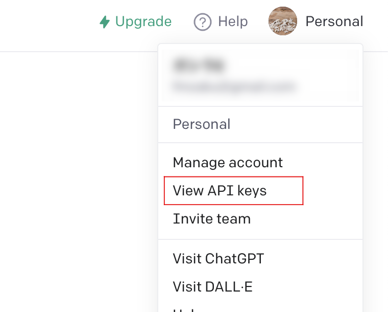
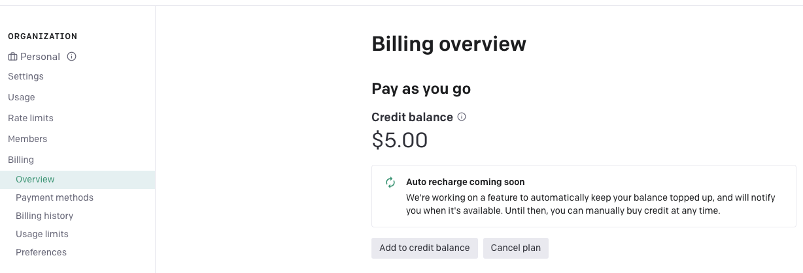
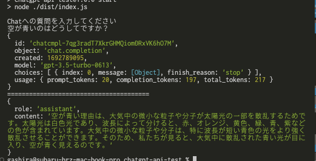

# ChatGPTのAPIとPluginについて

---

# 目次

- What ChatGPT?
- ChatGPT APIについて
- ChatGPT Pluginについて
- APIとPluginでできることの違い
- ChatGPT APIを実装してみる
- ChatGPT Plugin を実装してみる

---
## What ChatGPT？

ChatGPTとは、OpenAI社が公開した人工知能チャットボット
GPTから
GPT-4の公開とともに、ChatGPTでPluginという機能が使えるようになった

- GPTについて
- GPTの得意なこと、苦手なこと
- ChatGPTの活用事例

---
### What ChatGPT？ > **GPTについて**

GPTはOpenAI社が開発した、人間のように自然な文章を生成することができる言語モデル
GPT-3ではテキストを元に文章を予測し作成することができる。
GPT-4では画像なども元に画像の説明などを作成することもできる。

---
### What ChatGPT？ > **GPTの得意なこと、苦手なこと**

**得意**

- 自然な文章を作成する
- これまでのやりとりを参考にできる（やりとりができる）

**苦手**

- 正確な情報を作る
- 新しい情報を使用した専門的な文章生成

---
### What ChatGPT？ > **ChatGPTの活用事例**

- サイトのコンテンツ生成
- 簡単なプログラミング
- クイズの作成

---
## ChatGPT APIについて

ChatGPTの拡張機能の一つにAPIと言う機能があります。

- APIとは？
- 使用例
- 料金体系

---
### ChatGPT APIについて > **APIとは？**

多くのAPIはREST APIの設計で実装されているものとなっています。
APIが用意されることにより、例えば自社サービスからChatGPTが提供している機能を使用するために使用できます。
SlackやGoogleSpreadSheetからもChatGPTを使用することができます。

---
### ChatGPT APIについて > **使用例**

- [ChatPlus](https://chatplus.jp/customers/)
  - サイトの右下にあるようなお問い合わせを実装できるSaas
  - [少ないトレーニングデータでも企業独自の回答文生成が可能](https://prtimes.jp/main/html/rd/p/000000053.000019803.html)
- [Manual Force](https://manualforce.jp/)
  - WEBのマニュアル自動作成サービス
  - [マニュアルの文章を自動で作成してくれる](https://prtimes.jp/main/html/rd/p/000000006.000105447.html)
- [Parame Recruit](https://parame.jp/)
  - 採用時のリファレンスチェックサービス
  - [リファレンスチェック時の質問内容の自動生成](https://prtimes.jp/main/html/rd/p/000000023.000058683.html)

---
### ChatGPT APIについて > **料金体系 - 1**

トークンあたりでの従量課金制

**GPT-3.5 Turbo**

`Input: $0.0015 / 1K tokens` (1000トークン $0.0015)
`Output: $0.002 / 1K tokens` (1000トークン $0.002)

トークンとは、英語の１単語を１トークンとして計算し、 `,` などの記号も１トークンでカウントされる。
日本語だと、1文字が１トークン以上とカウントされることが多く、ひらがなは１トークン、漢字は２、３トークンで計算されることが多い。

---
### ChatGPT APIについて > **料金体系 - 2**

また、ChatGPTではこれまでのやり取りを参考にする場合は、これまでのやりとりも設定する必要がある。
やりとりも全て含めるとさらに料金が高くなる。
（なので、直前２メッセージだけ渡すなど工夫したほうがいい）

また、英語へ翻訳してから渡すというのも一つの手法

---
## ChatGPT Pluginについて

- Pluginとは？
- ChatGPTプラグインの特徴
- ChatGPTプラグインの使用例
- ChatGPTプラグインの利用料金

---
### ChatGPT Pluginについて > **Pluginとは？**

- プラグインとは、「拡張機能」という言葉で表されます。
- 基本的にそのサービスを拡張するための機能で、イメージとしてはChrome拡張機能などもそれにあたるかと思います。

---
### ChatGPT Pluginについて > **ChatGPTプラグインの特徴**

- ChatGPTをサードパーティのアプリと連携させる機能
- プラグインを導入することで、ChatGPTより拡張機能を介して外部のサービスを使用することができます。

---
### ChatGPT Pluginについて > **ChatGPTプラグインの使用例**

- 食べログ
  - ChatGPTの自然言語を使用して、食べログでネット予約可能な店舗の空席情報を簡単に検索できる
- Now
  - 現在TwitterやGoogleでトレンドとなっているものごとをChatGPTから探すことができる。
- Kakaku.com
  - 価格.comの情報を元にさまざまな商品の価格が比較できる

---
### ChatGPT Pluginについて > **ChatGPTプラグインの利用料金**

- プラグイン自体は料金がかかりません。
- プラグインを使用するためにはChatGPTで有料プランを契約している必要があるため月$20(¥3000)程度がが必要となります。

---
## APIとPluginでできることの違い

- APIとPluginでは主体となるサービスが違います。
  - APIでは外部サービスが主体となり、ChatGPTの機能を使用することができます。
  - PluginではChatGPTが主体となり、ChatGPTを使用しながらサービスの機能を使用することができます。

---
# ここからは実装編

実際に簡単に実装を行います。
JavaScript(TypeScript)にて実装を行います。
*プラグインは動作の確認まではできません。

---
## ChatGPT APIを実装してみる

- 使用するAPIを確認
- ChatGPTのAPIキーを取得
- 課金（初回クレジットあり）
- ChatGPT APIの呼び出しを実装
- Chat APIの仕様を確認

---
### ChatGPT APIを実装してみる > **使用するAPIを確認**

- [APIリファレンス](https://platform.openai.com/docs/api-reference/introduction)
- Node.jsではnpmを使用してモジュールをインストールできるようです。

---
### ChatGPT APIを実装してみる > **ChatGPTのAPIキーを取得**

- OpenAIのサイトへ遷移し、ChatGPTのAPIキーを取得します。

---
### ChatGPT APIを実装してみる > **課金（初回クレジットあり）**

- ChatGPTのAPIを利用するには、利用するためのクレジットが必要になります。
- Billingのメニューにてクレジットの購入が必要になります。
  - 初回クレジットが$5付与されますが、有効期限は３ヶ月となります。

---
### ChatGPT APIを実装してみる > **ChatGPT APIの呼び出しを実装**

<!-- TODO: リポジトリURLの設定 -->
[サンプルリポジトリ]()

---
### ChatGPT APIを実装してみる > **Chat APIの仕様を確認**

[ChatAPIのドキュメント](https://platform.openai.com/docs/api-reference/chat)

| Req body         | type   | 説明                              |
| :--------------- | :----- | :-------------------------------- |
| messages.role    | string | system, user, assistant, function |
| messages.content | string | 内容                              |

---
## ChatGPT Plugin を実装してみる

- Developer登録申請
- プラグインとして使用するREST APIの実装
- openapi.jsonの作成（生成）
- マニフェストファイルの作成
- 自身の作成したプラグインをカスタムで追加

---
## ChatGPT Plugin を実装してみる > **Developer登録申請**

- OpenAIのChatGPT Plugin waitlistにて登録が必要です。
- [waitlist](https://openai.com/waitlist/plugins)

---
## ChatGPT Plugin を実装してみる > **プラグインとして使用するREST APIの実装**

サンプルが用意できなかったため動作確認できず
[参考記事](https://tech.nri-net.com/entry/try_to_make_chatgpt_plugin)
---
## ChatGPT Plugin を実装してみる > **openapi.jsonの作成（生成）**

サンプルが用意できなかったため動作確認できず

---
## ChatGPT Plugin を実装してみる > **マニフェストファイルの作成**

マニフェストファイルのパラメータ解説 ([プラグインマニフェスト](https://platform.openai.com/docs/plugins/getting-started/plugin-manifest))

| パラメータ            | type   | 説明                             |
| :-------------------- | :----- | :------------------------------- |
| schema_version        | string | マニフェストファイルのバージョン |
| name_for_model        | string | ChatGPTのためのプラグイン名      |
| name_for_human        | string | 人間のためのプラグイン名         |
| description_for_model | string | ChatGPTのためのプラグイン説明    |
| description_for_human | string | 人間のためのプラグイン説明       |
| api                   | Object | openapi.json(yaml)のURL          |

---
## ChatGPT Plugin を実装してみる > **自身の作成したプラグインをカスタムで追加**

ここもサンプルが用意できなかったためありません。

